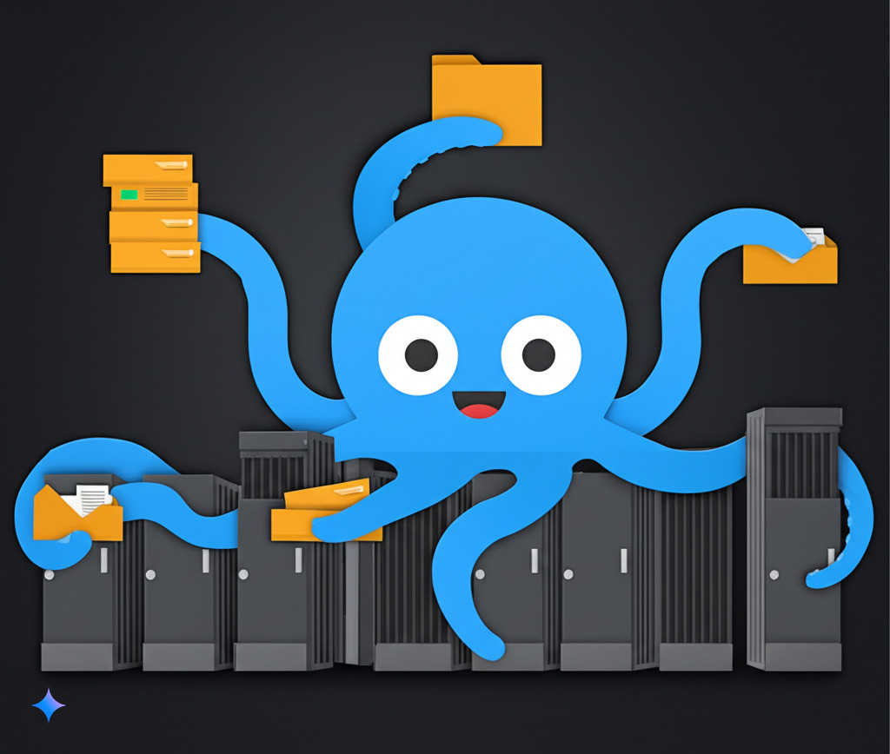

# Octopush - A Concurrent File Server

</img>

##

Octopush is a Go-based file server designed to handle file uploads, downloads, and other related operations in a concurrent manner. The project utilizes the Gin framework for routing and GORM for database interactions.

### Usage

#### Running the Server

1. **Clone the Repository**:

   ```bash
   git clone https://github.com/blackprince001/octopush.git
   ```

2. **Navigate to the Project Directory**:

   ```bash
   cd octopush
   ```

3. **Build and Run the Application**:

   ```bash
   go build -o octopush cmd/main.go
   ./octopush
   ```

   Alternatively, you can use Docker:

   ```bash
   docker build -t octopush .
   docker run -p 5678:5678 octopush
   ```

#### API Endpoints

- **Upload File**:

  ```bash
  curl -X POST http://localhost:5678/file/upload -F 'file=@path/to/your/file'
  ```

- **Download File**:

  ```bash
  curl http://localhost:5678/file/download/:shortLink
  ```

### Features and Future Improvements

- [X] Upload
- [X] Download
- [ ] Grouped Upload (recursively uploading every file in group)
- [ ] Grouped Download (recursively downloading every file in group)

### Contributing

Contributions are welcome. Here are some ways you can contribute:

- **Pull Requests**: Submit pull requests for new features, bug fixes, or improvements.
- **Issue Reports**: Report any issues or bugs you encounter.
- **Documentation**: Help improve the documentation by adding more details or clarifying existing sections.
